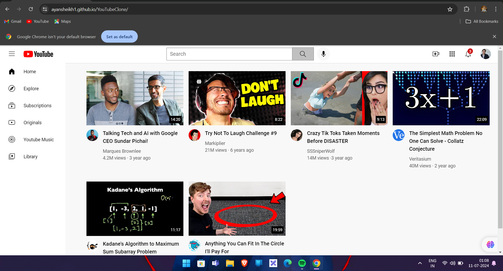

# YouTube Clone

## Table of Contents
- [Introduction](#introduction)
- [Features](#features)
- [Technologies Used](#technologies-used)
- [Installation](#installation)
- [Usage](#usage)
- [Screenshots](#screenshots)
- [Contact](#contact)

## Introduction
The YouTube Clone is a web-based application that mimics the basic functionality and design of YouTube. This project is built using HTML and CSS, demonstrating a static yet visually appealing and responsive interface for video browsing and playback.

## Features
- Responsive design for various screen sizes.
- Video player interface.
- Basic navigation for exploring different video categories.
- Search bar for finding videos (static).

## Technologies Used
- **HTML5**: For structuring the content.
- **CSS3**: For styling and layout.

## Installation
1. Clone the repository:
    ```bash
    git clone https://github.com/Ayansheikh1/YouTubeClone.git
    ```
2. Navigate to the project directory:
    ```bash
    cd YouTubeclone
    ```

## Usage
1. Open `index.html` in your web browser to view the YouTube Clone website.
    ```bash
    open index.html
    ```

## Screenshots
### Home Page


## Contact
For any questions or suggestions, please contact:
- **Sheikh Ayan Sheikh Ashpak **
- Email: ayansheikh0698@gmail.com
- GitHub: [Ayansheikh1](https://github.com/Ayansheikh1)
